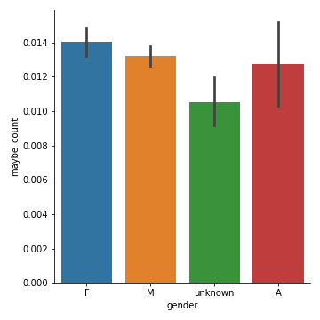

# Hollywood and Gender: A Quantitative Analysis of Movie Dialogues
by Mack Campbell

# Introduction

# Background

Current language, gender, and sexuality (LGS); variationist, and discourse analytic frameworks approach gender as performative and nonbinary (Sauntson 2020 **PAGE NUMBER?**). However, for the sake of a quantitative approach with large amounts of data--such as the current project--some of these considerations are harder to apply. Pop culture helps to perpetuate the stereotype that men and women speak differently, but that is disproven by research (Saunston and Fried). To that end, I will be comparing the same metrics across all gender markers and highlighting any similarities and differences. Staying honest to the LGS framework, there is an important caveat about the gender markers in this research. The gender markers in this corpus do not indicate anything about the actor's or the character's actual gender presentation/identity. (**Note about the differences?**) With ambiguous names and positions there is an element of a nonbinary approach to gender, (list the different markers here?) but work could be improved on this area in future research.

While the gender markers in the present research is not ideal for current LGS research, it is representative of how gender was understood during the timeframe of the corpus which ranges from 1927-2010.

# Data sourcing

Originally I found the [Cornell Movie Quotes Corpus](https://www.cs.cornell.edu/~cristian/memorability.html) which is related to the data ultimately selected for analysis. The data are freely available online [here](https://www.cs.cornell.edu/~cristian/Chameleons_in_imagined_conversations.html) or directly in Python through ConvoKit. For sake of ease I put copies of the data in this repo [here](data/).

# Data cleanup

When I began working with the character data frame, I quickly discovered that the gender markers were inconsistent (both 'm' and 'M' were present) and that over 6,000 of the characters did not have a gender [link](). Updating the gender markers to all upper case was an easy fix, but generating gender markers took several passes with NLTK names list and specific strings to fill in the missing data [link](). The `NLTK` python library has lists for male and female names. Just using these lists I was able to add a little over 2,000 names. Some names appear on both lists (although some of these are questionable inclusions). For these names I marked the characters' gender as 'A' for ambiguous.

One of the characters from the first movie in the corpus, *10 Things I Hate About You*, is named 'Miss Perky' which lead me to think about other possible address terms and other words that could indicate a character's gender. I looked at familial terms (mom, dad, son, daughter), address terms (Mr., Mrs., Ms.), positions/careers (lord, priest, waitress, nun), and explicit gender terms (dude, guy, chick). For ambiguous positions I included some positions that may have stereotypical gendered expectations with them but I included them as ambiguous to try to remove as much bias as possible from the analysis. These terms included (doctor, nurse, lawyer, and pilot).

The initial gender breakdown can be found below in Figure 1.

Figure 1: Initial gender breakdown 

The gender breakdown after all the cleanup detailed above can be found in Figure 2 below.

Figure 2: Final gender breakdown 

Cleaned and manipulated versions of the data can be found [here](/new_data).

# Analysis

The longest conversation has 89 turns, evenly split between its male (Dante) and female (Caitlin) character. However, Caitlin has 922 tokens compared to Dante who only has 532. Based on Halmari 1999 this could be interpreted as Caitlin having more conversational power. On the other hand, this could play into the popular stereotype that women speak more than men. Although the rest of the corpus indicates the exact opposite: there are more male characters and they have the most number of lines in the corpus at 188,089 more than twice as many as female characters who only have 82,750 lines/turns. [link]

As a way to analyze the speech in the corpus, I selected two hedging phrases and four hedging words (the analysis can be found [here]()). I searched the corpus for usage of the following: *I guess*, *I think*, *maybe*, *might*, *perhaps*, and *possibly*. Female characters use *I guess*, *I think*, and *maybe* the most. For *might*, *perhaps*, and *possibly* characters with unknown gender have the highest usage. For *I think* and *maybe* male characters are not far behind in usage, but the ANOVA tests still indicate that the difference across the groups are significant at p ≥ 0.05. *Possibly* was the least used out of the hedging words and phrases and was also the only word or phrase that did not have significant variance across the groups. Figures x - x show the bar plots for hedging.

Figure x: *I guess* usage 

Figure x: *I think* usage 

Figure x: *Maybe* usage 

Figure x: *Might* usage 

Figure x: *Perhaps* usage 

Figure x: *Possibly* usage 

The mean usage for the hedges were relatively small, but ANOVA tests were conducted on all 6 items and all were significant at p ≥ 0.05 except for *possibly*. This can be seen visually in Figure x above, as the means are much closer together for all genders compared to the other figures. Based on these findings there is difference in how the genders are represented usage hedging in their speech. O'Barr and Atkins (1980) moved to rename the register termed "Women's Language" by Robin Lakoff to "Powerless Language" as they found features of this register used by both men and women on the witness stand in courtrooms. Part of the register is hedging, therefore female characters in this corpus are regularly situated as being less powerful compared to their male counterparts.

# Conclusion

Future research in this area could compare the POS findings to another corpus with gender information (ideally a corpus of more natural occurring speech) to see how the POS usage compares. This would allow us to qualify how accurate movie representation is of naturally occurring speech in regards to the four parts of speech chosen for analysis here. On the data-cleaning side, having names lists from other languages and cultures would help to generate more gender markers which would allow for more accurate analysis of the data.

# History of the Project

# References
