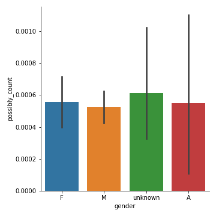

# Hollywood and Gender: A Quantitative Analysis of Movie Dialogues
by Mack Campbell

# Introduction

My data come from the [Cornell Movie Dialogue Corpus](https://www.cs.cornell.edu/~cristian/Chameleons_in_imagined_conversations.html). The data are separated into data about the movies, the characters, the conversations, and the movie lines. I am approaching this analysis partially through a discourse analysis lens so going forward I will use the terms *turns* and *utterances* where the original corpus uses the term *lines*. In addition to looking at discourse in the corpus, I am considering how gender is represented. Therefore, the research questions guiding me are the following: "How are gender roles represented across the time span of the corpus? Specifically, how do length of turns change over time?" and "How do hedges and parts of speech usage differ across gender?"

# Background

Current language, gender, and sexuality (LGS); variationist, and discourse analytic frameworks approach gender as performative and nonbinary (Sauntson 2020 pp. 1-3). However, for the sake of a quantitative approach with large amounts of data--such as the current project--some of these considerations are harder to apply. Pop culture helps to perpetuate the stereotype that men and women speak differently, but that is disproven by research (Saunston pp. 4-5). To that end, I will be comparing the same metrics across all gender markers and highlighting any similarities and differences. Staying honest to the LGS framework, there is an important caveat about the gender markers in this research. The gender markers in this corpus do not indicate anything about the actor's or the character's actual gender presentation or identity. The gender markers for characters in this corpus are: male, female, ambiguous, and unknown. Ambiguous gender is marked if the characters name can be either female or male, or if they have an ambiguous position/title. Unknown gender, on the other hand, is marked if the character's gender was not able to be determined based on name or any other words, I will describe the process in the data cleanup section below. With ambiguous names and positions included, there is an element of a nonbinary approach to gender but work could be improved on this area in future research. While the gender markers in the present research is not ideal for current LGS research, it is representative of how gender was understood during the timeframe of the corpus which ranges from 1927-2010.

# Data sourcing

Originally I found the [Cornell Movie Quotes Corpus](https://www.cs.cornell.edu/~cristian/memorability.html) which is related to the data ultimately selected for analysis. The data are freely available online [here](https://www.cs.cornell.edu/~cristian/Chameleons_in_imagined_conversations.html) or directly in Python through ConvoKit. For sake of ease I put copies of the data in this repo [here](data/).

The corpus is composed of 617 movies from 1927-2010 with 9,033 characters. These characters had 304,713 lines with a total of 4,181,442 tokens.

# Data cleanup

When I began working with the character data frame, I quickly discovered that the gender markers were inconsistent (both 'm' and 'M' were present) and that over 6,000 of the characters did not have a gender, which can be seen [here](https://nbviewer.org/github/Data-Science-for-Linguists-2023/Movie-Gender-Dialogue-Analysis/blob/main/dataframe_notebooks/Characters_Notebook.ipynb#Loading-in-the-data-and-basic-summary). Updating the gender markers to all upper case was an easy fix, but generating gender markers took several passes with NLTK names list and specific strings to fill in the missing data. [This notebook](https://nbviewer.org/github/Data-Science-for-Linguists-2023/Movie-Gender-Dialogue-Analysis/blob/main/dataframe_notebooks/Characters_Notebook.ipynb#Generating-gender-markers) contains the work adding gender markers to the data. The `NLTK` python library has lists for male and female names. Just by using these lists I was able to add a little over 2,000 names. Some names appear on both lists (although some of these are questionable inclusions). For these names I marked the characters' gender as 'A' for ambiguous.

One of the characters from the first movie in the corpus, *10 Things I Hate About You*, is named 'Miss Perky' which lead me to think about other possible address terms and other words that could indicate a character's gender. I looked at familial terms (mom, dad, son, daughter), address terms (Mr., Mrs., Ms.), positions/careers (lord, priest, waitress, nun), and explicit gender terms (dude, guy, chick). For ambiguous positions I included some positions that may have stereotypical gendered expectations with them but I included them as ambiguous to try to remove as much bias as possible from the analysis. These terms included (doctor, nurse, lawyer, and pilot).

The initial gender breakdown can be found below in Figure 1.

Figure 1: Initial gender breakdown 

The gender breakdown after all the cleanup detailed above can be found in Figure 2 below.

Figure 2: Final gender breakdown 

The conversation data were the cleanest. The only issue was the `dialogue` column was not properly reading in as a list, but I was able to fix that by following [this](https://stackoverflow.com/questions/32742976/how-to-read-a-column-of-csv-as-dtype-list-using-pandas) Stack Overflow thread. I exploded the lists so each turn in a conversation was its own line in the data frame and duplicated the index to create a `conversation_ID` which I used in downstream analysis and synthesis. [This notebook](https://nbviewer.org/github/Data-Science-for-Linguists-2023/Movie-Gender-Dialogue-Analysis/blob/main/dataframe_notebooks/Conversations_Notebook.ipynb) walks through my clean up process.

For the movie data I dropped the `IMDB_rating` and `IMDB_votes` columns. The `year` column had some additional characters at the end of some of the years which made further analysis impossible. I stripped the string and converted them to integers. Because the movies in the corpus span 80+ years I added a `movie_decade` column to make analysis over time easier. This cleaning can be see [here](https://nbviewer.org/github/Data-Science-for-Linguists-2023/Movie-Gender-Dialogue-Analysis/blob/main/dataframe_notebooks/Movies_Notebook.ipynb). I did not include any analysis on movie genre, but future research could incorporate this element.

For the utterances data I tokenized the dialogue into sentences and words using `NLTK`. I added columns calculating the sentence count, token count, and average sentence length per turn. This work can be found [here](https://nbviewer.org/github/Data-Science-for-Linguists-2023/Movie-Gender-Dialogue-Analysis/blob/main/dataframe_notebooks/Utterances_Notebook.ipynb).

`.csv` files of the cleaned and manipulated versions of the data can be found [here](/new_data).

# Analysis

# Discourse analysis

There is variance between average token counts by decade for each gender. Figures 3 - 6 below show this change.

Figure 3: Female tokens by decade 

Figure 4: Male tokens by decade 

Figure 5: Unknown tokens by decade 

Figure 6: Ambiguous tokens by decade 

The differences seen above are all significant at p ≤ 0.05. Halmari (1999) found that longer turns can be associated with situational power. With this in mind, and the results from Figures 3 - 6 above, this indicates that there is change over time in how gender gets represented in the movies in this corpus in regards to their relationship to conversational power. Figure 7 below shows the token count by gender for all the movies in the corpus. The variance was also significant at p ≤ 0.05.

Figure 7: Gender tokens

The longest conversation has 89 turns, evenly split between its male (Dante) and female (Caitlin) character. However, Caitlin has 922 tokens compared to Dante who only has 532. Based on Halmari's research, this could be interpreted as Caitlin having more conversational power. On the other hand, this could play into the popular stereotype that women speak more than men. Although the rest of the corpus indicates the exact opposite: there are more male characters and they have the most number of lines in the corpus at 188,089, which is more than twice as many as female characters who only have 82,750 lines. [This notebook](https://nbviewer.org/github/Data-Science-for-Linguists-2023/Movie-Gender-Dialogue-Analysis/blob/main/analysis_notebooks/Discourse_Analysis.ipynb) contains the discourse analysis.

## Hedging

As a way to analyze the speech in the corpus, I selected two hedging phrases and four hedging words (the analysis notebook can be found [here](https://nbviewer.org/github/Data-Science-for-Linguists-2023/Movie-Gender-Dialogue-Analysis/blob/main/analysis_notebooks/Hedging.ipynb)). I searched the corpus for usage of the following: *I guess*, *I think*, *maybe*, *might*, *perhaps*, and *possibly*. Female characters use *I guess*, *I think*, and *maybe* the most. For *might*, *perhaps*, and *possibly* characters with unknown gender have the highest usage. For *I think* and *maybe* male characters are not far behind female characters in usage, but the ANOVA tests still indicate that the difference across the groups are significant at p ≤ 0.05. *Possibly* was the least used out of the hedging words and phrases and was also the only word or phrase that did not have significant variance across the groups. Figures 8 - 13 show the bar plots for hedging.

Figure 8: *I guess* usage 

Figure 9: *I think* usage 

Figure 10: *Maybe* usage 

Figure 11: *Might* usage 

Figure 12: *Perhaps* usage 

Figure 13: *Possibly* usage 

The mean usage for the hedges were relatively small, but ANOVA tests were conducted on all 6 items and all were significant at p ≥ 0.05 except for *possibly*. This can be seen visually in Figure 13 above, as the means are much closer together for all genders compared to the other figures. Based on these findings there is difference in how the genders are represented usage hedging in their speech. O'Barr and Atkins (1980) moved to rename the register termed "Women's Language" by Robin Lakoff to "Powerless Language" as they found features of this register used by both men and women on the witness stand in courtrooms. Part of the register is hedging, therefore female characters in this corpus are regularly situated as being less powerful compared to their male counterparts.

## Parts of Speech

I looked at the usage rates of adverbs, adjectives, conjunctions, and interjections to see if there were differences in these POS across gender in [this notebook](https://nbviewer.org/github/Data-Science-for-Linguists-2023/Movie-Gender-Dialogue-Analysis/blob/main/analysis_notebooks/POS_Analysis.ipynb). Because these parts of speech are not required elements in a phrase, there are multiple turns where there are zero instances of any of them. Out of all four, adverbs were the most used and had the most even distribution across all genders. However, ANOVA tests found that all four POS usage are significant at p ≤ 0.05. Figures 14 - 17 show the bar plots for POS usage.

Figure 14: Adverb usage 

Figure 15: Adjective usage 

Figure 16: Conjunction usage 

Figure 17: Interjection usage 

Based on the results of the ANOVA test, we can conclude that POS usage is a way that genders can be differentiated in the corpus.

# Conclusion

Future research in this area could compare the POS findings to another corpus with gender information (ideally a corpus of naturally occurring speech) to see how the POS usage compares. This would allow us to qualify how accurate movie representation is of naturally occurring speech in regards to the four parts of speech chosen for analysis here. On the data-cleaning side, having names lists from other languages and cultures would help to generate more gender markers which would allow for more accurate analysis of the data. Another way to view the data would be to take movie genre into account, to see if genre has any influence on how gender is represented.

Based on these results, there are quantifiable differences between how gender is represented in the movies in this corpus. Specifically, parts of speech, hedging, and turn length are significant indicators of gender difference. Over time there is also significant difference in turn length for all genders in the corpus. Considering movies are prominent in pop culture, it makes sense that movie dialogue furthers the pop culture notion that there is a difference between genders, especially the way that they speak. While research has disproven this difference in naturally occurring speech, the notion of difference is still being perpetuated in entertainment.

# History of the Project

The biggest hiccup was trying to generate the characters' gender markers. This was the most important step as all the analysis is based on gender representation in the corpus. Ultimately Na-Rae provided the shell for the function that I used [here](https://nbviewer.org/github/Data-Science-for-Linguists-2023/Movie-Gender-Dialogue-Analysis/blob/main/dataframe_notebooks/Characters_Notebook.ipynb#Generating-gender-markers). I kept refining the strings used to generate different markers and was able to incrementally increase the number of characters that could be coded for gender. For POS analysis I initially ran NLTK's POS tagger but switched to spaCy's instead. SpaCy does a better job tagging, but it also took considerably longer to run through the entire data frame to generate tags. I thought that the data would be a little easier to work with because it was a pre-compiled corpus, but there still ended up being cleaning and manipulating for me to do. Multiple times during the process I had to separate and reorganize my notebooks as they became too large to be reader-friendly. This ultimately made my repo more organized and easier to follow so it was worthwhile, but splitting the code up into new notebooks was cumbersome.

# References
Halmari, H. (1999). Power relationships and register variation in Väinö Linna’s *Here under the Northern Star*. *Journal of Finnish Studies*, *3*(2), 36-49. 
Saunston, H. (2020). *Researching language, gender and sexuality: A student guide*. Routledge. 
O’Barr, W. M. and Atkins, B. K. (1980) Women’s language’ or ‘powerless language’?. In S. McConnell-Ginet, R. Borker, and N. Furman(Eds.), *Women and language in literature and society* (pp. 93-110). Praeger Publishers.
